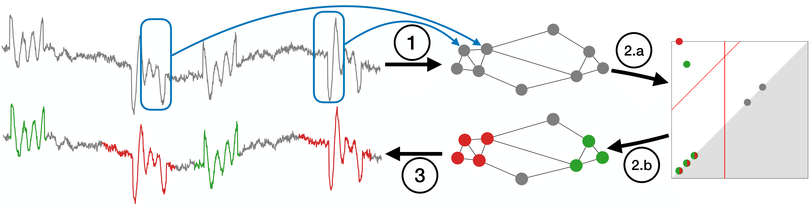

<h1 align="center">Interactive motif discovery in time series with persistent homology</h1>

<div align="center">
<p>

</p>
</div>

## Abstract
Time series analysis based on recurrent patterns, also called motifs, has emerged as a powerful approach in various domains. However, uncovering recurrent patterns poses challenges and usually requires expert knowledge. This paper introduces an interactive version of the PersistentPattern algorithm (PEPA), which addresses these challenges by leveraging topological data analysis. PEPA provides a visually intuitive representation of time series, facilitating motif selection without needing expert knowledge. Our work aims to empower data mining and machine learning researchers seeking deeper insights into time series. We provide an overview of the PEPA algorithm and detail its interactive version, concluding with a demonstration of abnormal heartbeat detection.

## Application & algortihm overview 

### Workflow of the PersistentPattern algorithm (PEPA)

<p align="center">
  
  <figcaption>
    <ul>
      <li>Step 1, From time series to graph: Transforms a time series into a graph where nodes are subsequences and edges are weighted with a distance between subsequences. </li>
      <li>Step 2, Graph clustering with persistent homology:  Identifies clusters representing motifs from the persistence diagram and separates them from irrelevant parts of the time series with two thresholds (red lines).</li>
      <li>Step 3: From clusters to motif sets: Merges temporally adjacent subsequences in each cluster to form the variable length motifs.</li>
    </ul>
  </figcaption>
</p>

### Application GUI

<p align="center">
  
  <figcaption>
    Workflow of the PersistentPattern algorithm (PEPA). Step 1, From time series to graph: Transforms a time series into a graph where nodes are subsequences and edges are weighted with a distance between subsequences. 
    Step 2, Graph clustering with persistent homology:  Identifies clusters representing motifs from the persistence diagram and separates them from irrelevant parts of the time series with two thresholds (red lines).
    Step 3: From clusters to motif sets: Merges temporally adjacent subsequences in each cluster to form the variable length motifs.
  </figcaption>
</p>


## Functionalities
- Paper's experimental results can be found in the jupyter notebook [exp_results_paper.ipynb](https://github.com/thibaut-germain/Persistent-Pattern-Discovery/exp_results_paper.ipynb)
- Paper's illustration can be found in the jupyter notebook [paper_illustration.ipynb](https://github.com/thibaut-germain/Persistent-Pattern-Discovery/paper_illustration.ipynb)
- To run an experiment, use the following command from the root folder:
  ```(bash)
  python experiment/<foldername>/script_<foldername>.py
  ```
  If all experiments are re-run, the new results can be displayed with thejupyter notebook [exp_results_paper.ipynb](https://github.com/thibaut-germain/Persistent-Pattern-Discovery/exp_results_paper.ipynb)


## Prerequisites

1.  download and unzip the datasets at the root folder from the following archive:

```(bash) 
https://drive.google.com/file/d/1tfOXKbk7rhAqF4jzuMkrgklcYU3qtWzY/view?usp=sharing
```
2. All python packages needed are listed in [requirements.txt](https://github.com/thibaut-germain/Persistent-Pattern-Discovery/requirements.txt) file and can be installed simply using the pip command: 

```(bash) 
conda create --name perspa --file requirements.txt
``` 


## Reference

If you use this work, please cite:

